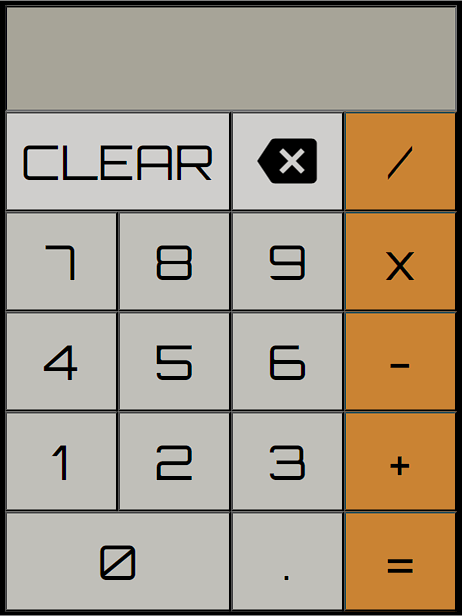

# Calculator

## Description
  This is a simple calculator application.

## Visuals

## Table of Contents
- [Calculator](#calculator)
  - [Description](#description)
  - [Visuals](#visuals)
  - [Table of Contents](#table-of-contents)
  - [Installation](#installation)
  - [Usage](#usage)
  - [License](#license)
  - [Questions](#questions)

## Installation
Packages required to use this application: None

## Usage
The purpose of this application is to allow users to quickly solve basic math with ease.

## License
MIT

## Questions
Link to creator's GitHub: [Steveb175](https://github.com/Steveb175)